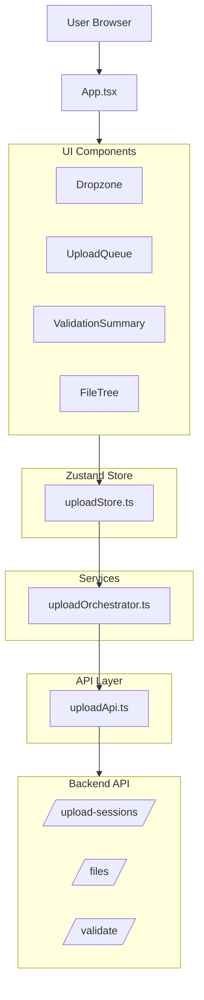

```mermaid
flowchart TD

    User[User Browser]

    App[App.tsx]

    User --> App

    subgraph UI[UI Components]
        Dropzone[Dropzone]
        UploadQueue[UploadQueue]
        ValidationSummary[ValidationSummary]
        FileTree[FileTree]
    end

    subgraph Store[Zustand Store]
        UploadStore[uploadStore.ts]
    end

    subgraph Services[Services]
        Orchestrator[uploadOrchestrator.ts]
    end

    subgraph API[API Layer]
        UploadApi[uploadApi.ts]
    end

    subgraph Backend[Backend API]
        Sessions[/upload-sessions/]
        Files[/files/]
        Validate[/validate/]
    end

    App --> UI
    UI --> UploadStore
    UploadStore --> Orchestrator
    Orchestrator --> UploadApi
    UploadApi --> Backend
```